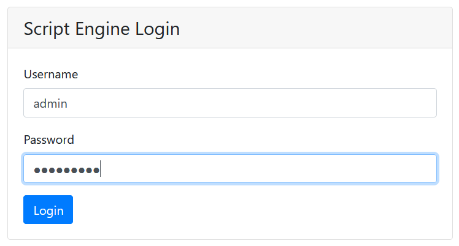
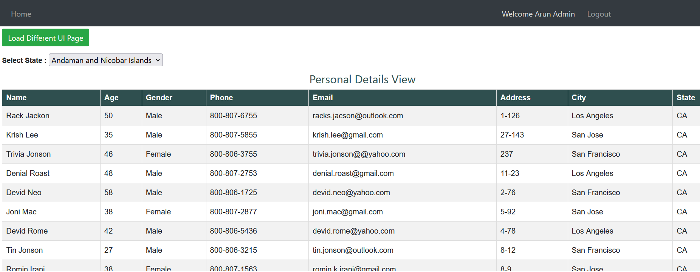
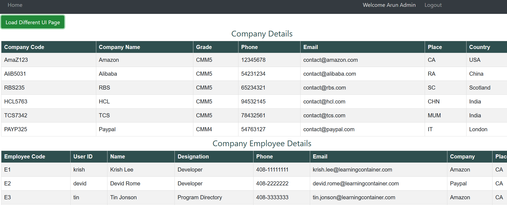
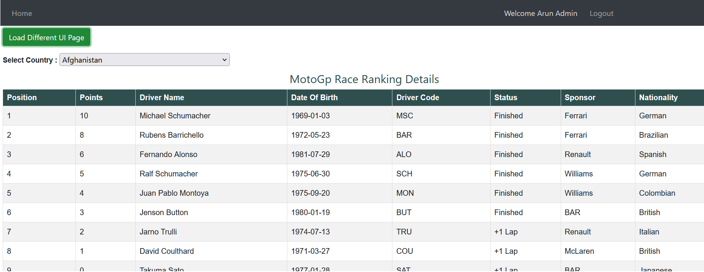

## UI Engine

It allow to create a new page layout, modify already existing layout by adding or modifying the json configuration without changing any ui code. It will parse the json configuration to identify the components required to create the page layouts. 

* Using `fakeserver` authentication for login
    * **Admin Login:** admin/admin@123
    * **User Login:** user/user@123 
* Using `routing` to navigate to login and home page
* Using `httpInterceptor` for adding the header information for all API request
* Using the `json-server` to exose API without using backend server
* It allow to load the different layout pages
* It allow to use same component with different features supported depends on the configuration. This example tried with Datagrid and dropdown component only and support to extend these feature for other UI component as well.
    * **DataGrid:**
        * It allows to load the data from locally
        * It allows to load the data from api calls
        * It support for pagination
        * It support for adding the title
    * **Dropdown**
        * It allows to load the data from locally
        * It allows to load the data from api calls
        * It support to change the dropdown label


### Setup json-server
___

1. Installing the json-server package by executing `npm install -g json-server` command
2. Create the json data file with sample data
3. Run the json-server by using `json-server --watch src/app/_data/uiconfig.json` command

This example expose the below json api without using the any backend code.

``` 
Resources
  http://localhost:3000/page1
  http://localhost:3000/page2
  http://localhost:3000/page3
  http://localhost:3000/page4
  http://localhost:3000/griddata1
  http://localhost:3000/griddata2
  http://localhost:3000/dropdowndata

Home
  http://localhost:3000
```


### Build and Run the application
___

1. Checkout the project 
2. Run `npm install` for downloading the dependnecy of this project
3. Run the `json-server` by following the above given steps
4. Run `ng serve` for bundled and launching the application
5. Launch the url `http://localhost:4200` in any browser to test the application


### Screenshot reference
___

Please refer the below screenshot for more reference










